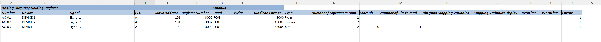

# Generic Modbus PLC

The **Generic Modbus PLC** connector displays an overview of all the inputs and outputs provided by an Excel file.

## About

The connector will poll all the inputs and outputs with the bus address configured for the element.

To import or export Excel files, the Microsoft.ACE.OLEDB.12.0 is necessary on the server. You can download this from the following page: <https://www.microsoft.com/en-us/download/details.aspx?id=23734>

If you want to use the export function, you need to provide an empty Excel file with or without headers. When an export is created, the tables will then be placed on the sheets of the Excel file.

### Version Info

| Range     | Description                            | DCF Integration     | Cassandra Compliant     |
|------------------|----------------------------------------|---------------------|-------------------------|
| 1.0.0.x          | Initial version.                       | No                  | Yes                     |
| 1.0.1.x          | Major change by QA (DisplayKey).       | No                  | Yes                     |
| 1.0.2.x          | Major change: changed naming.          | No                  | Yes                     |
| 1.0.4.x          | Major change: The slave address is now dynamically retrieved from the registers table. Alarm Page: Functions similarly to the register pages, with alarm-specific registers added as per the device documentation.          | No                  | Yes                     |

### Product Info

| Range | Supported Firmware Version |
|------------------|-----------------------------|
| 1.0.0.x          | Any                         |
| 1.0.4.x          | Any                         |

## Installation and configuration

### Creation

#### Serial Main connection

This connector uses a serial connection and requires the following input during element creation:

SERIAL CONNECTION:

- Interface connection:

  - **IP address/host**: The polling IP of the device.
  - **IP port**: 502
  - **Bus address**: The bus address of the device. Range: *0* to *255*.

### Configuration

When using the connector for the first time, ensure that the configuration file is located in the Documents folder within DataMiner (e.g., **C:\Skyline DataMiner\Documents\Generic Modbus PLC**). Detailed instructions on the file format and required data can be found in the [Configuration File](#configuration-File) section.

### Configuration File

The configuration file must include Excel sheets designated for the following registers:

**DI** – Digital Input,
**DO** – Digital Output,
**AI** – Analog Input,
**AO** – Analog Output,

An additional sheet for alarms should be named **Alarms**.

To complete the configuration file, refer to the device documentation, which defines the fields for the register values that need to be retrieved. Below is an example of how to fill in the file with dummy data:

**Required Fields for Retrieving Registers:**
- **Slave Address:** The address of the slave device.
- **Register Number:** The register number associated with the data to be retrieved.
- **Modicon Format:** For Analog Outputs, this field should be the value 40000 + Register Number.
- **Number of Registers to Read:** Specifies how many registers should be read for the given value.

**Optional Fields for Processing and Interpretation:**
The remaining fields help with processing and provide better clarity for interpreting the retrieved information from the registers. These fields are used for internal processing and are not mandatory for retrieving the registers.

The **Template** with all the pages and fields that you can use for loading onto the element and retrieving data from the device after filling it out according to the device documentation can be found here: [Template](https://skylinebe.sharepoint.com/:x:/s/DeviceDocumentation/EYWnTbve1ghMjJyi5dEfRnYBvx2bFNPzB-qTDgKkhoeAtQ?e=XgGFRB).

## Usage

### General 
On the General page, there is a **Polling Control** option where you can choose between:
- **Poll by Timer:** Polling occurs at set intervals.
- **Poll Continuous:** Registers are polled constantly, and values are continuously updated.
  
Additionally, you have the option to show or hide pages for specific registers if they are not in use.

### Import/Export

On this page, you can **Import Excel** an Excel file to populate the tables, enabling the connector to start polling the connections effectively.
If not all files are displayed, you can use the **Refresh Files** button to update the file list.

You can also **Export Excel** the tables from the element to an Excel file here.

### Analog Input

This page displays the **Analog Input** connections with the current value and all the information imported from the Excel file.

### Analog Output

This page displays the **Analog Output** connections with the current value and all the information from the Excel file. The current value can also be modified here.

### Digital Input

This page displays the **Digital Input** connections with the current value and all the information from the Excel file.

### Digital Output

This page displays the **Digital Output** connections with the current value and all the information from the Excel file. The current value can also be modified here.

