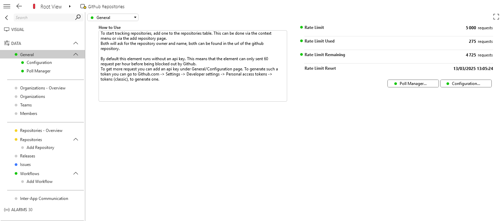

# GitHub Repositories

## About

This DataMiner connector allows you to monitor and control GitHub repositories. It uses the GitHub API to poll the repos and execute actions on them.

## Getting Started

#### Step 1: Deploy the Low Code App Editor package

1. Click the **Deploy** button to deploy the connector directly to your DataMiner System.
1. Optionally, go to [admin.dataminer.services](https://admin.dataminer.services/) and verify whether the deployment was successfull.

#### Step 2: Create an element

1. Open DataMiner Cube and navigate to the *Surveyor* module.
1. Right-click a view and select *New* -> *Element*
1. Give it a name
1. Select the **Github Repositories** protocol and the latest version
1. Fill in **https://api.github.com** as the IP address/host
1. Press *Create*

#### Step 3: Configuring the element

1. Go to [Github.com](https://github.com)
1. Sign in and go to *Settings* -> *Developer settings* -> *Personal access tokens* -> *Tokens (classic)*
1. After generating a new token go back to the element and put in the API Key parameter on the *General/Configuration* page.

#### (Optional) Step 4: Add a GitHub Repository

1. Go to the Repositories page
1. Right-click on the table and select *Add...*
1. Fill in the name and owner of the repository
1. Press *Ok*

## Contributing

To contribute to this connector, create a fork on Github and create a pull request. We will do a code review on the changes as soon as possible and merge in the suggestions.

## Support

For additional help, reach out to [arne.maes@skyline.be](mailto:arne.maes@skyline.be)