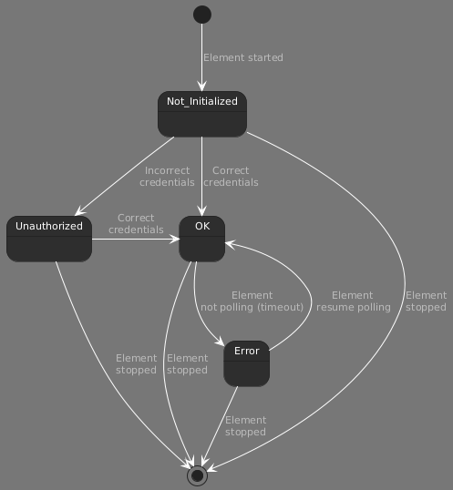

# Microsoft Platform

The Microsoft Platform connector enables the monitoring of servers that run the Microsoft Windows OS.

## About

The Microsoft Platform connector empowers organizations to achieve comprehensive, real-time monitoring of your Microsoft Windows-based servers. Leveraging Windows Management Instrumentation (WMI), this connector provides deep visibility into system performance, health metrics, and operational status, ensuring proactive management and swift resolution.

## Key Benefits

- Broad Compatibility: Supports all versions of Microsoft Windows, ensuring seamless integration across diverse server environments.

The Microsoft Platform connector gathers key performance indicators from a server running the Microsoft Windows OS. To accomplish this, the connector utilizes Windows Management Instrumentation ([WMI](https://learn.microsoft.com/en-us/windows/win32/wmisdk/wmi-start-page)) extensions to query data from the monitored server.

All versions of Microsoft Windows are supported, as long as the connector is able to retrieve data using WMI.

### Version Info

| Range | Description | DCF Integration | Cassandra Compliant |
|--|--|--|--|
|7.0.0.x [SLC Main]| Initial version| No | Yes |

> [!IMPORTANT]
> Currently, range versions 1.1.3.x and 6.0.0.x are still supported. However, we strongly recommend to use new driver range 7.0.0.x.

## Configuration

### Connections

#### Virtual Connection

This connector uses a virtual connection and does not require any input during element creation. However, once the element is created, it is necessary to configure the connection settings (available in the page General -> Connections).

In addition, WMI and DCOM must be properly configured on the server to be monitored, as detailed below.

> [!IMPORTANT]
> Since this is a virtual connector, WMI queries sent to the target server are not displayed in the [Stream Viewer](https://docs.dataminer.services/user-guide/Troubleshooting/Logging/Monitoring_real-time_communication/Connecting_to_an_element_using_Stream_Viewer.html)
> Currently the default timeout is set to XXX

TODO: Check what is the hardcoded timeout

#### WMI configuration

1. To go to WMI Control Properties, go to **Start** \> **Run** and enter *wmimgmt.msc*.
1. Right-click **WMI Control (Local)** and select **Properties**.
1. On the **Security** tab page, go to \\Root\CIMV2 and click the **Security** button.
1. Add the user that will be used to query data from the remote server to the list and give the user all rights.
1. Apply all.

#### DCOM configuration

1. Go to **Start** \> **Run** and enter *dcomcnfg* (Component Services).
1. Under **Component Services** \> **Computers**, right-click **My Computer** and select **Properties**.
1. Go to the tab **COM Security**.
1. Under **Launch and Activation Permissions**, click **Edit Limits**.
1. Add the user and give the user the *Local Launch*, *Remote Launch*, and *Remote Activation* permissions.
1. Apply all.

>[!NOTE]
>
> - After DCOM settings have been changed, the WMI services sometimes need to be restarted.
> - This method works fine for a Windows XP system but cannot be used on a Windows Server 2003 SP1.
> - On a Win2K3, the local user must be added to the administrators group.
> - On a Win2K8, the local user must be added to the administrators group, Distributed COM Users, and Performance Monitor Users.

### Initialization

Once the element is created, you can configure the credentials used to query the target server on the **Connections** page (located under the **General** section).

- If the element monitors the same DataMiner agent on which it is hosted, you can use either *localhost*, or *127.0.0.1* as hostname.

- If the element monitors a different DataMiner agent, specify the IP address or hostname of the remote agent.

- When using credentials from a domain controller, be sure to include the domain name (e.g. domain\myDomainUser).

>[!IMPORTANT]
> After modifying the settings on the **Connections** page, it is required to click the button *Connect* to apply the changes. The connector will not use the updated settings this action is completed.
> When the element is created, it will not start polling any data until the hostname **and** credentials are set in the **Connections** page.

### Connection States



## How to use

The **General** page provides details about the operating system running on the monitored server. The page *OS Updates* displays details about the recently installed patches on the server.

The **CPU** page offers information related to the processor, including usage metrics, as well as thread and handle counters. The *Logical Processors* page presents utilization metrics for each logical processor.

The **Memory** page provides information about the physical and virtual memory allocation of the monitored server.

The **Network** page contain information about the network adapters available in the monitored server. Additional metrics, such as bitrates, are available in the page **Details**.

The **Process** page lists all the current processes run by the monitored server (similar to the *Task Manager* tool available in any Microsoft Windows OS). The connector will remove any process from the table that is no longer running in the monitored server.

Under the **Process** page, there is 

### Task Manager

The Task Manager page lists all the processes run by the monitored server (similar to the *Task Manager* tool available in any Microsoft Windows OS). Each entry in the **Task Manager** table represents a process active on the monitored server.

By default, the connector will poll all the running processes on the monitored server. You can modify this behavior by setting the parameter **Poll Task Manager** to *Off*.

Also by default, the connector will remove any process that is no longer running from the Task Manager table. You can modify this behavior by setting the parameter **Auto Clear Task Manager** to *Off*

> [!TIP]
> If you wish to monitor when a process is no longer running, set the parameter **Auto Clear Task Manager** to *Off*. By enabling monitoring on the parameter **Row Status**, you can then generate an alarm when a process is no longer running.

The button **Clear Task Manager** allows you to clear the Task Manager table manually. This button is useful only if the parameter **Auto Clear Task Manager** is set to *Off*

To set the current values in the table as the normal reference for alarms, click the button **Normalize Alarms**. You can then view these references via the **Nominal Values** button at the bottom of the page.

> [!IMPORTANT]
> The Normalize Alarms feature is deprecated. Instead, we recommend [configuring dynamic alarm thresholds](https://aka.dataminer.services/configuring-dynamic-alarm-thresholds).

It is also possible to add a filter to calculate the sum of the memory usage of all processes that match this filter. To do so:

1. Click the button **Cumulated Memory** at the bottom of the page.

1. Enter a filter in the box **Add Filter Param**. An asterisk (\*) wildcard is supported in this filter. You can also use an exclamation mark (\!\) to return the opposite cumulated memory of the filter parameter. (See examples below.)

   |Examples|Description|
   |--------|-----------|
   |SLDatam\*|Searches for processes that begin with "SLDatam"|
   |\*Dataminer\*|Searches for processes that contain the word "DataMiner"|
   |miner:0*|Searches for processes that end with "miner:0"|
   |SLDataminer:0|Searches for the process "SLDataminer:0"|
   |!SLDatam*|Searches for processes that do not begin with "SLDatam"|
   |!\*Dataminer*|Searches for processes that do not contain the word "DataMiner"|
   |!miner:0*|Searches for processes that do not end with "miner:0"|
   |!SLDataminer:0|Searches for processes that are not equal to "SLDataminer:0"|

If necessary, add more filters, or delete filters using the **Delete** button next to the filtered parameter.

#### Task Manager Measurement

Clicking the button **Measurement Config** will open the **Task Measurement Config** page. This page allows you to customize the processes listed in the **Task Manager** table. The following parameters are available for this:

- The parameter **Task Manager Default Measurement State** will enable/disable the measurement of new processes.
- The parameter **Task Manager Auto Refresh Measurement Table** allows you to automatically refresh the Task Manager Measurement Config table.
- The parameter **Task Manager Auto Clear Measurement Table** allows you to automatically remove processes that are no longer running on the server.

In addition, the buttons **Disable All**, **Enable All**, **Clear**, and **Refresh** allow you to manually perform the actions covered by the parameters listed above.

To disable or enable the monitoring of a specific process in the Task Manager table (i.e. remove or add the process from/to the Task Manager table), proceed as follows:

1. Locate the process to be removed in the **Task Manager Measurement Config** table.
1. In the column **Task Polling**, set the value to *Disable* or *Enable* accordingly.

>[!NOTE]
> By default, the **Task Manager Measurement Config** table will list the same processes as the **Task Manager** table, and the column **Task Polling** will be set to *Not Initialized*.

### Network Interface

This page displays the **Network Adapter** table. This table monitors the network adapters available in the server.

> [!NOTE]
> The bandwidth of an adapter can be very high (*e.g. 10 GB/s*). Therefore, as the utilization gets calculated as the total speed divided by the bandwidth, the utilization value can be extremely low. It can even be rounded down to 0.00 % if *Total Speed \< 0.005 \* Bandwidth*.

By default, the column **Adapter Description** will contain the name of the adapter as retrieved by [WMI](https://learn.microsoft.com/en-us/previous-versions/aa394293(v=vs.85)). However, in some cases, the connector will not be able to retrieve the name. If this is the case, it is possible to customize this name of the adapter.

> [!IMPORTANT]
> Once the column **Adapter Description** is set manually, the connector will not overrule this setting. Updating the name could cause metrics related to this network adapter to not be retrieved. If you set a network adapter to a description that is already used by another adapter, the description of the other adapter will be set to an empty string.

On the **Network Adapter Measurement** page, you can disable processes to remove them from the **Network Adapter** table.

- The parameter **Network Adapter Default Measurement State** allows you to enable/disable the measurement of new adapters.

- The **Clear** button removes all deleted processes from the **Network Adapter Measurement** and **Network Adapter** table. This is by default followed by a refresh.

- The **Refresh** button can be used to manually refresh the list of network adapters and the additional information.

You can also entirely disable the polling of the network adapters with the toggle button **Poll Network Adapters**.

Once an adapter is disconnected and not found by the connector, its status will be set to *Disconnected*. You can choose to either remove such adapters automatically (using the button **Auto Clear Disconnected Adapters**) or manually delete them using the parameter **Manually Clear Disconnected Adapters**.

>[!NOTE]
> The parameter **Manually Clear Disconnected Adapters** will only list disconnected adapters.

### Disk Info

This page provides information about local storage devices on a server running Windows.

>[!TIP]
> A sign that could indicate that the disk is busy is the *Latency*, i.e. how long it takes before it can process something. This metric can be tracked with the parameter **Avg Disk sec/Transfer Rate**.

### Event Viewer

This page displays information regarding selected or created events.

When you enable the Event Viewer, you can monitor the events displayed in the **Event Viewer** table.

If you want to add events, click the **Add event** page button. If you click **Load**, all the event messages from a specific time interval will be retrieved and displayed on the page. You can then select the events you want to monitor by clicking the **Monitor Event** button. The time interval can be changed using the slider.

To delete a monitored event, click the **Delete** button in the **Event Viewer** table.

The event details can be configured. For each type of event (information, warning, or error), the severity of the created alarm can be selected from the dropdown list. For example: "Disk Crash" event with a **Severity Error Type** equal to *Critical*.

When the configured **Alarm Type** equals ***Normal*** and an event occurs that matches one of the added filters in the **Event Viewer Messages** table, the new event will automatically trigger an alarm or an information event. **Alarm Type** ***Grouped*** will add the row to the **Grouped Event Alarms** with the most recent severity of the event. When the **Grouped Event Active Time** expires, the event is removed from the table. Grouped events will not create alarms automatically, but you can configure alarm monitoring on the **Grouped Event Type** column.

From version 1.1.0.100 onwards, it is possible to get all events except those with a specific **Event ID**. In each row of the table, a toggle button **Exclude Event ID** has been added:

- If it is set to the default setting ***Include***, you can insert a **single event ID** or the value **"\*"** to **get all event IDs** for the relevant source/category (= **equal to all previous versions**).

- If it is set to ***Exclude***, you can select a **single event ID**, which will be omitted from the results. All other event IDs will be selected.

### Performance Monitor

This page monitors performance counters added by the user.

On the **Config Performance Counters** page, you can search for performance counters and add them to the **Performance Monitor** table:

1. Click **Refresh Categories** to create a dropdown list with the **Categories**.
1. Select the category and then select a **Counter**. If the counter has multiple instances, you can either select the **Instance** you want, or select *\<All Instances\>.*
1. Finally, click the **Add Counter** button to add the selected counter to the table.

With the **Performance Monitor Sample Time**, you can configure the sample time for all created performance counters.

### Dell

This page focuses on Dell computer hardware.

It monitors certain high-level parameters, such as the name, version, and model. It also includes pages with more information on specific categories:

- The **Temperature Probe Table** provides information about the temperature of the device.
- A page is available for the **power supply**, **fans**, **CPU**, and **memory** information for the device.
- The **Disk** page provides an overview of all the disks included in the system.

>[!IMPORTANT]
> In order to monitor these parameters, you have to enable polling on the **Dell** page.

### HP

This page focuses on HP computer hardware.

It monitors the same set of parameters as the Dell page described above.

>[!IMPORTANT]
> In order to monitor these parameters, you have to enable polling on the **HP** page.

### Software Info

This page contains the **Software Info Table**, which displays a list of all installed programs.
**Note: USERNAME and PASSWORD have to be set! (Under Performance \> Security Settings).**

Above the table, it is possible to select the polling method. (Alternative methods were introduced after problems were encountered with the used WMI Query.)

- *No Polling*: Nothing will be retrieved, and the table will remain empty.
- *Win32_Product*: WMI Query used to retrieve a list of all installed programs. We strongly advise **not to use this method**, as this can perform a Windows Installer "reconfiguration" on every MSI package as it is performing the query.
- *Win32reg_AddRemoveProgram*: WMI Query used to retrieve a list of all installed programs if Microsoft CSSM software is installed. This is a better alternative to the Win32_Product method.
- *Registry Keys*: **Recommended method.** This method will use WMI to read the registry keys to display a list of all installed programs in the system.

## Troubleshooting

### Access is denied with error code 0x80070005 (or 0x80041003)

**Symptom**

The following errors are shown in the Stream Viewer (when looking at the communication of any group):

- Access is denied with error code 0x80070005
- Access is denied with error code 0x80041003

**Cause**

The username does not have enough permissions to query the server, specifically when performing remote WMI queries using non-admin users.

**Resolution**

- Access is denied with error code 0x80070005: See [DCOM configuration](#dcom-configuration)
- Access is denied with error code 0x80041003: See [WMI configuration](#wmi-configuration)
- If the above options do not solve the issue, try to open Windows Explorer on the monitored server, using the username that you configured on the [Settings](#initialization) page. If it is not possible to connect to the server because you have to log on with the account *guest*, execute the following steps:

  1. Go to **Control Panel** \> **Administrative Tools** \> **Local Security Policy**.
  1. Go to **Local Policies** \> **Security Options**.
  1. Double-click **Network access: Sharing and security model for local accounts**.
  1. Select **Classic- local users authenticate as themselves**.

> [!NOTE]
> To confirm that a user does not have the rights to perform WMI queries, you can proceed as follows:
>
> 1. Click **Start** \> **Run** and execute *wmimgmt.msc*.
> 1. Right-click **WMI Control (Local)** and select **Connect to another computer**.
> 1. Select **Actions** \> **More Actions** \> **Properties**.
>
> At this point, you will receive the following error:
>
> ```text
> Failed to connect to [\\%RemoteIP%](file:///) because "Win32 Access is denied".
> ```
>
> If the above steps are not possible, you could also run **wmimgmt.msc** directly on the server (from CMD or PowerShell). You will receive the following error: Microsoft Management Console "An attempt was made to reference a token that does not exist".

### Not all parameters are initialized

**Symptom**

A Microsoft element displays a partial set of the data. Some parameters, such as *Local Time*, *Total Physical Memory*, etc. are populated, while others like *Total Processor Load*, *Total Handles* remain not initialized. Looking at the **Stream Viewer**, you notice certain queries do not return any results.

**Cause**

There can be different possible causes for this behavior. Refer to the possible resolutions below.

**Resolution**

- Check the element timeout settings. When an element is created, these are the default values:

  - Timeout of a single command: 6000 ms
  - Number of retries: 3

  Update the timeout value if necessary, and validate whether the element is now able to poll all parameters.

- Execute the following command (using CMD or PowerShell) to manually reset the counters with WMI (for more information, refer to [Microsoft Learn](https://learn.microsoft.com/en-us/troubleshoot/windows-server/performance/manually-rebuild-performance-counters)):

  ```cmd
  winmgmt.exe /resyncperf
  ```

- Verify whether the user used to query the server is included in the group *Performance Monitor Users*.

### Query failed: Retrieving the data failed. (hr = 0x80041010)

**Symptom**

Stream Viewer shows the following error:

```text
Query failed : Retrieving the data failed. (hr = 0x80041010) for numerous WQL SELECT queries.
```

**Cause**

Some or all related Disable Performance Counters in regedit for `PerfDisk`, `PerfNet`, `PerfOS`, `PerfProc`, `Tcpip`, or `W3SVC` are set to **1**. With the path below, you can confirm if these counters are disabled:

```text
"HKEY_LOCAL_MACHINE\SYSTEM\CurrentControlSet\Services\PerfProc\Performance\
```

When wbemtest is used and these queries are performed, or the classes are listed, this results in similar errors mentioning "Invalid class".

**Solution**

Set all these to **0**, and after a couple of minutes the query errors should disappear and the related data should get filled in.

### Contacting Server Failed: Connection to root/cimv2 failed. The RPC server is unavailable

**Symptom**

The following error occurs:

```text
Contacting server failed: Connection to \[//server/root/cimv2\] failed. The RPC server is unavailable. (hr = 0x800706BA).
```

**Cause**

Configuration issue on the remote server.

**Solution**

- Make sure TCP/135 and TCP/49000-65535 (WMI) are open.
- Make sure the user is created on server and host.

### Performance Monitoring not working

**Symptom**

The element is able to populate all parameters, except the Performance Monitor. Clicking *Refresh Categories* triggers the following error in element logging:

```text
Exception Perf Counters The network path was not found.
```

**Cause**

Possible configuration issue on the remote server.

**Solution**

Check if the destination computer has the "Remote Registry" service running. If not, start this service. (Note that you may need to adjust the Startup Type from *Disabled* to *Manual/automatic* first.)

### Percent Disk Busy Time goes above 100%

**Symptom**

The parameter **Percent Disk Busy Time** shows values higher than 100%.

**Cause**

By design.

**Resolution**

Not applicable. More information can be found in the [Microsoft Knowledge Base](http://support.microsoft.com/kb/310067).

## Additional Notes

### Windows Vista

From Windows 2000 onwards, WMI is installed by default. Except in Windows Vista, WMI uses random ports. To configure a fixed port in Windows Vista:

1. In the command prompt window, type *winmgmt -standalonehost.*
1. Stop the WMI service by typing the command *net stop "Windows Management Instrumentation"*.
1. Restart the WMI service in a new service host by typing *net start "Windows Management Instrumentation"*.
1. Establish a new port number for the WMI service by typing *netsh firewall add portopening port=24158 name=WMIFixedPort*.

If you want to have access to the WMI interface of a Windows XP computer, you can work with a local user (a group user, not an administrator) that has the necessary Windows security rights, so extra configuration is necessary on the client computers.

### Re-registering the WMI component on the monitored server

In some situations, you will need to re-register the WMI component in the monitored server.

- For 32-bit Windows OS, the `.dll` and `.exe` files used by WMI are located in `%windir%\system32\wbem`.
- For 64-bit Windows OS, these files are located in `%windir%\sysWOW64\wbem`.

To re-register the WMI components, run the following commands with the command prompt:

```cmd
cd /d %windir%\system32\wbem*
for %i in (*.dll) do RegSvr32 -s %i
for %i in (*.exe) do %i /RegServer
```

### Information Resources

- [How to Enable Remote WMI Access for a Domain User Account](https://martellotech.com/blog/enable-remote-wmi-access-for-a-domain-user-account/)
