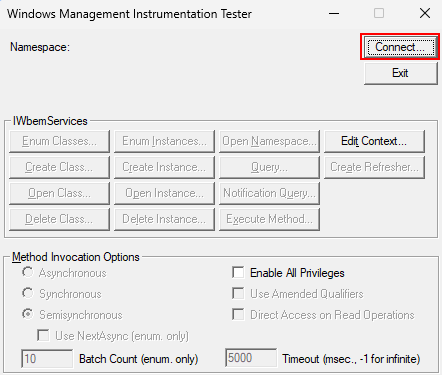
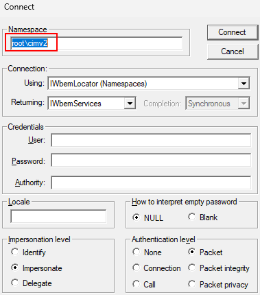
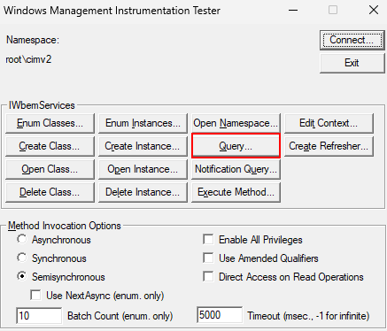
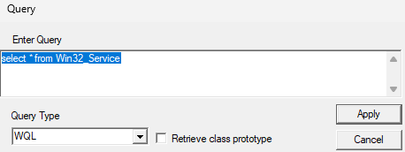
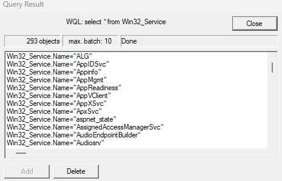

# Microsoft Platform - WMI Tools

## Windows Management Instrumentation Tester (WBEMTEST)

WBEMTEST is a built-in tool available on all Windows installations. It allows you to run and test WMI (Windows Management Instrumentation) queries **locally**, which is useful for troubleshooting configuration or permission-related issues and verifying the availability of requested WMI data.

### How to use

Open the Start menu and type *wbemtest* into the search or run dialog box.

When you launch WBEMTEST, different operating system will work slightly different. Some will automatically connect to connect to a WMI namespace, but other will not. In case you are not connected to automatically to a WMI namespace, click the *Connect* button.

In the next page, set as namespace *root/cimv2* if it is not already set, then click *Connect*. After connecting, you will return to the main user interface with full functionality enabled (prior to connecting, most buttons are greyed out).

> [!NOTE]
>
> - If you don't provide credentials, the tool will use the credentials of the currently logged-in user.
> - In case your are not able to connect, you can enter alternate on the **Connect** screen. This is helpful for testing access with different user accounts.

Once you are logged in, you can perform WMI queries on the server to confirm that the server is able to reply to WMI queries.

To perform queries, click the *Query* button.

In the following screen, you can test WMI queries. In the following example, we will receive the list of services available in the server:

If the server is able to reply correctly, you should be able to see the result of the query:

> [!TIP]
> More information about the WMI queries executed by the Microsoft Platform connector can be found in [Microsoft Platform - WMI Queries](xref:microsoft_platform_technical_wmi_queries).
