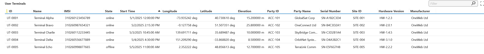
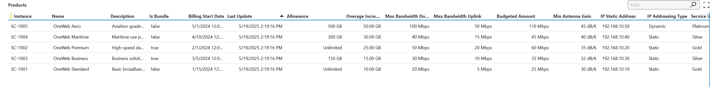
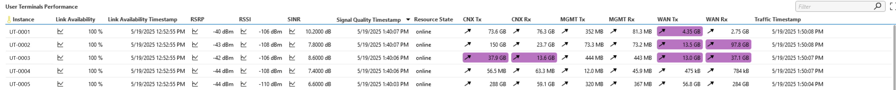
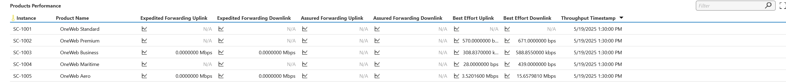
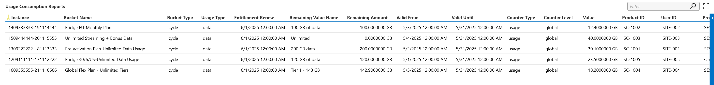

# OneWeb Enterprise

## About
The OneWeb Enterprise connector enables seamless monitoring of OneWeb's Low Earth Orbit (LEO) satellite services through HTTP-based APIs using JSON data. 

Designed for enterprise environments, it offers real-time insights into key resources such as User Terminals, Products, Organizations, and Sites. With visibility into Performance Metrics and Service Usage, organizations can optimize operations and ensure reliable satellite connectivity—especially in remote or challenging locations.

## Key Features
### Monitor User Terminals
Monitor every connected User Terminal with full transparency. Gain instant access to critical identifiers like IMEI and device names, along with real-time visibility into network state, firmware versions, and hardware configurations. Understand terminal deployments better through geographic coordinates and relationship mapping with Distribution Partners and Site Connectivity.

### Monitor Products
Track and manage service plan inventory with precision. Each product is tied directly to a Distribution Partner and a deployment site, offering full traceability. Dive deeper into product usage by linking services to specific User Terminals and customer accounts — ensuring you always know who’s using what, where, and how.

### Performance Monitoring
Stay ahead with continuous performance insights. Measure and trend key metrics such as Link Availability, Signal Quality, and Throughput across both User Terminals and Products. Identify bottlenecks early, optimize service delivery, and make data-driven decisions backed by historical performance tracking.

### Usage Reports
Track data usage in near real-time to stay in control of monthly allowances. Visualize how consumption evolves throughout the billing cycle with clear breakdowns of entitlements, balances, and overages. Each usage report is product-linked, allowing you to connect the dots back to the responsible User Terminal and site for a complete usage profile.

